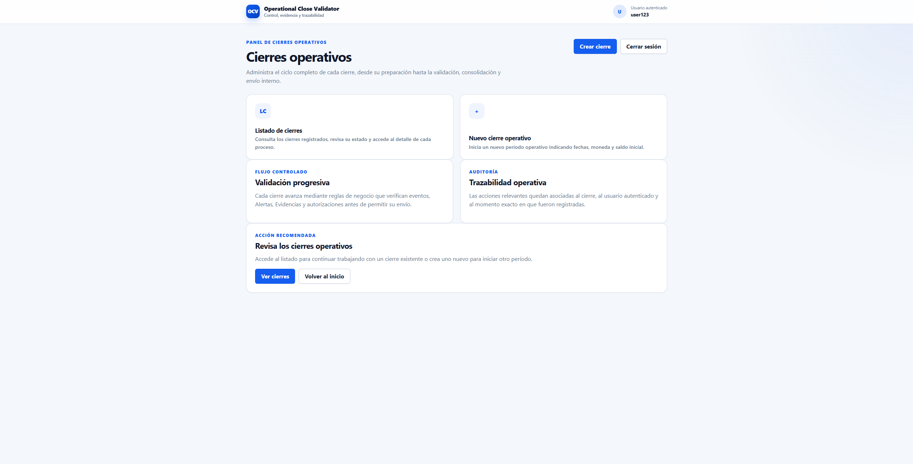
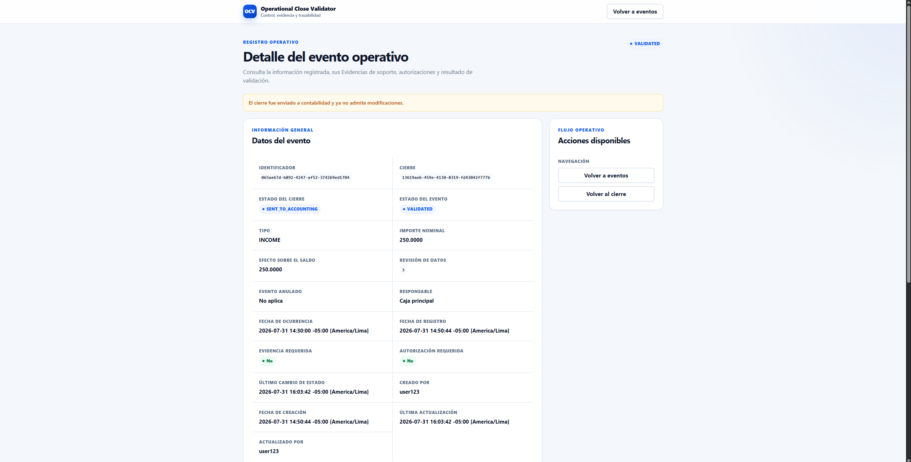
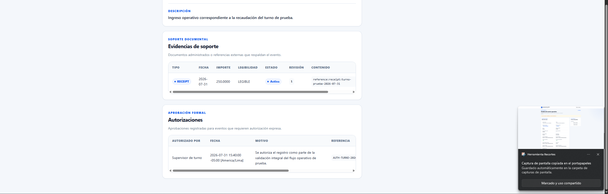

# Operational Close Validator

Sistema de validación temprana que detecta eventos operativos sin sustento, sin autorización o con inconsistencias antes de consolidar el cierre y enviarlo a contabilidad.

## Vista del producto

### Panel principal



### Detalle del evento operativo



### Evidencias y autorizaciones



### Inicio de sesión


## Problema

Los cierres operativos suelen requerir reprocesos manuales porque los comprobantes faltantes, las autorizaciones informales o los registros inconsistentes se descubren durante la consolidación final o después del envío a contabilidad.

Operational Close Validator adelanta estas verificaciones para que los problemas sean detectados y corregidos antes de que el cierre abandone el dominio operativo.

## Objetivo del MVP

Demostrar que el sistema puede:

1. Registrar un cierre operativo.
2. Registrar ingresos, egresos, descuentos y anulaciones.
3. Identificar eventos que requieren evidencia o autorización.
4. Registrar la información de soporte del evento.
5. Ejecutar reglas de validación deterministas.
6. Generar resultados bloqueantes cuando existan inconsistencias.
7. Permitir la corrección y revalidación del evento.
8. Consolidar únicamente cierres válidos.
9. Enviar el cierre consolidado a contabilidad.
10. Impedir modificaciones después del envío.

## Flujo principal

```text
Creación del cierre
        ↓
Registro de eventos operativos
        ↓
Registro de evidencias y autorizaciones
        ↓
Validación de eventos
        ↓
Corrección de inconsistencias
        ↓
Consolidación del cierre
        ↓
Envío a contabilidad
        ↓
Modo de solo lectura